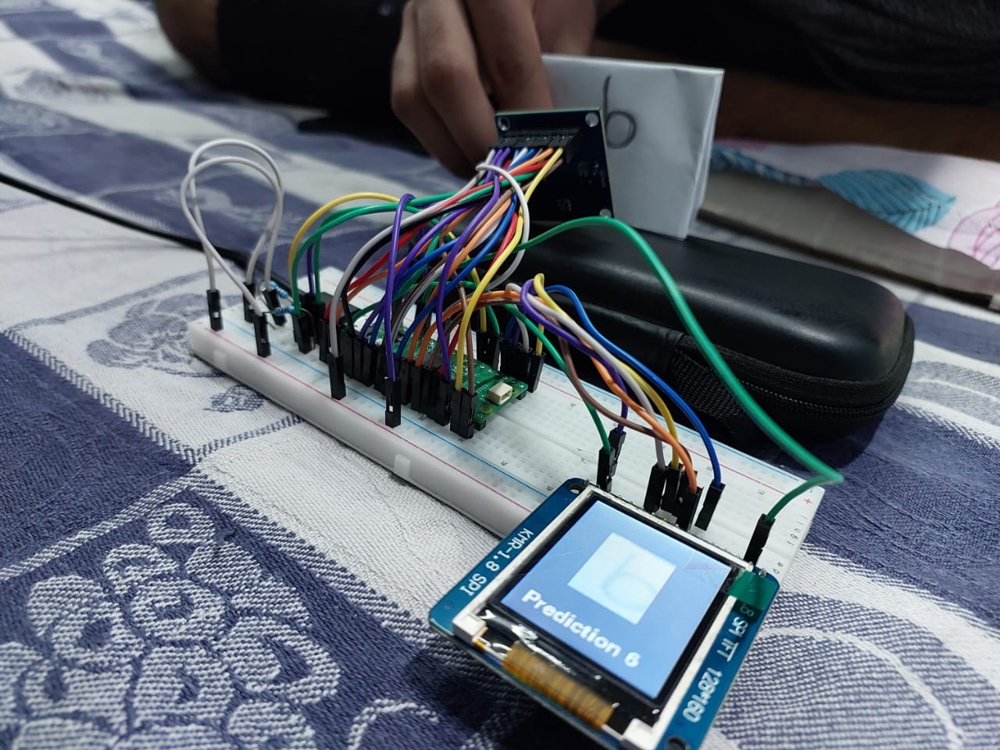

# Image Classification on ARM-Cortex m4 Microcontroller

## Table of Contents

- [Introduction](#introduction)
- [Hardware Requirements](#hardware-requirements)
- [Software Requirements](#software-requirements)
- [Getting Started](#getting-started)
  - [Install MU Editor](#1-install-mu-editor)
  - [Download Files](#2-download-files)
  - [Connect Hardware](#3-connect-hardware)
  - [Open MU Editor](#4-open-mu-editor)
  - [Load Code](#5-load-code)
  - [Upload Code](#6-upload-code)
  - [Follow Instructions](#7-follow-instructions)
- [Running the Code](#running-the-code)
- [Watch the video](#watch-the-project-in-action)

## Introduction

This project enables you to set up a Raspberry Pi Pico with a 128x160 TFT LCD and an OV7670 Camera Module. Machine learning models (Decision Tree, Logistic Regression, or SVM) are used for image recognition tasks. This README provides step-by-step instructions on how to get started.

## Hardware Requirements

- Raspberry Pi Pico
- 128x160 TFT LCD
- OV7670 Camera Module
- Full-sized breadboard
- Jumper cables
- B-Type USB cable

## Software Requirements

- MU Editor
- Google Colab (for training the machine learning model)
- Trained Model m2cgen Code Files (decision_tree_min.py, logistic_regression_min.py, svm_min.py)

## Getting Started

Follow these steps to set up and run the project:

### 1. Install MU Editor

Install the MU Editor on your computer. You can find the installation instructions on the MU Editor website.

### 2. Download Files

Download the necessary files to your computer:

- Model files (svm_min.py, logistic_regression_min.py, decision_tree_min.py)
- Training files (Trained Model.ipynb, model_training.ipynb)
- Libraries listed in lib_folder_contents.txt (place these in a folder named "lib" on your Raspberry Pi Pico)
- The Helvetica-Bold-16.bdf font file

### 3. Connect Hardware

- Connect your Raspberry Pi Pico to your computer using the B-Type USB cable.
- Set up the hardware components as per the project requirements, including the TFT LCD and OV7670 Camera Module, on the breadboard.
  ## Pin Configuration
The below table shows connections for the LCD
| Display Pin Number | Display Pin Name | Pi Pico Pins |
| ------------------- | ---------------- | ------------ |
| 2                   | VCC              | 5V           |
| 1                   | GND              | GND          |
| 10                  | CS               | GP18         |
| 6                   | RESET            | GP17         |
| 7                   | A0               | GP16         |
| 8                   | SDA              | GP11         |
| 9                   | SCL              | GP10         |
| 15                  | LED              | 3.3V         |

## OV7670 Camera Module Connections

| OV7670 Pin name | Pi Pico Pin Name                      |
| --------------- | ------------------------------------- |
| D0              | GP0                                   |
| D1              | GP1                                   |
| D2              | GP2                                   |
| D3              | GP3                                   |
| D4              | GP4                                   |
| D5              | GP5                                   |
| D6              | GP6                                   |
| D7              | GP7                                   |
| PCLK            | GP8                                   |
| MCLK            | GP9                                   |
| HS              | GP12                                  |
| VS              | GP13                                  |
| PDWN            | GP15                                  |
| RESET           | GP14                                  |
| SCL             | GP21 (via 4.7k external pull up resistor) |
| SDA             | GP20 (via 4.7k external pull up resistor) |

### 4. Open MU Editor

Launch the MU Editor software on your computer.

### 5. Load Code

Select the "code.py" file in the MU Editor.

### 6. Upload Code

Click the "Run" button in the MU Editor to upload the code to your Raspberry Pi Pico.

### 7. Follow Instructions

Once the code is uploaded, follow the on-screen instructions to start using the program.

## Running the Code

To run the code on your Raspberry Pi Pico, ensure you have completed the setup steps mentioned above and uploaded the correct model file (svm_min.py, logistic_regression_min.py, or decision_tree_min.py) based on your chosen machine learning model. The program will make use of the selected model for image recognition tasks.

For training or modifying machine learning models, refer to the provided training model files (Trained Model.ipynb, model_training.ipynb) and use Google Colab for training purposes.

Enjoy working on your Raspberry Pi Pico camera project!
## Watch the Project in Action

Click the image above to watch the project demonstration on YouTube.

